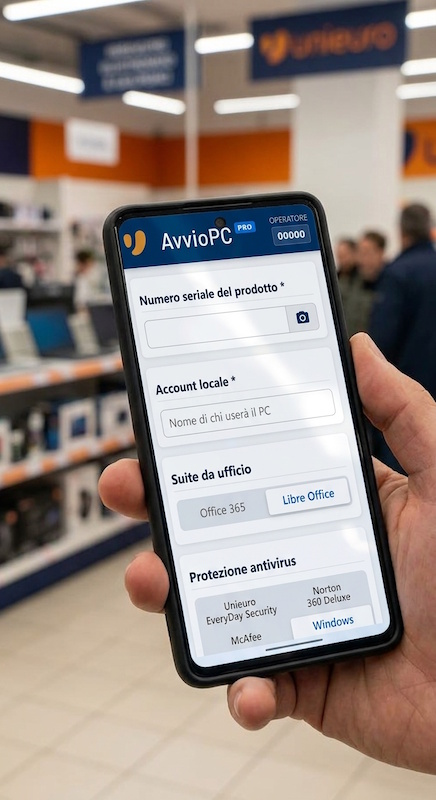
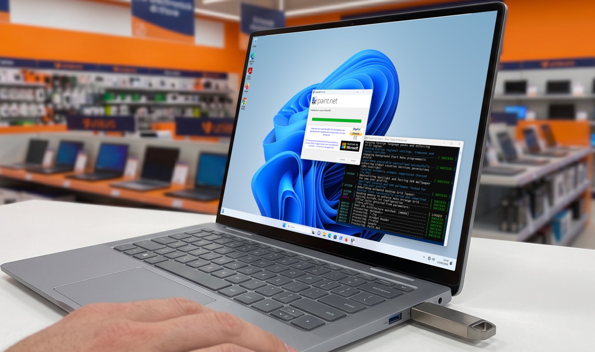
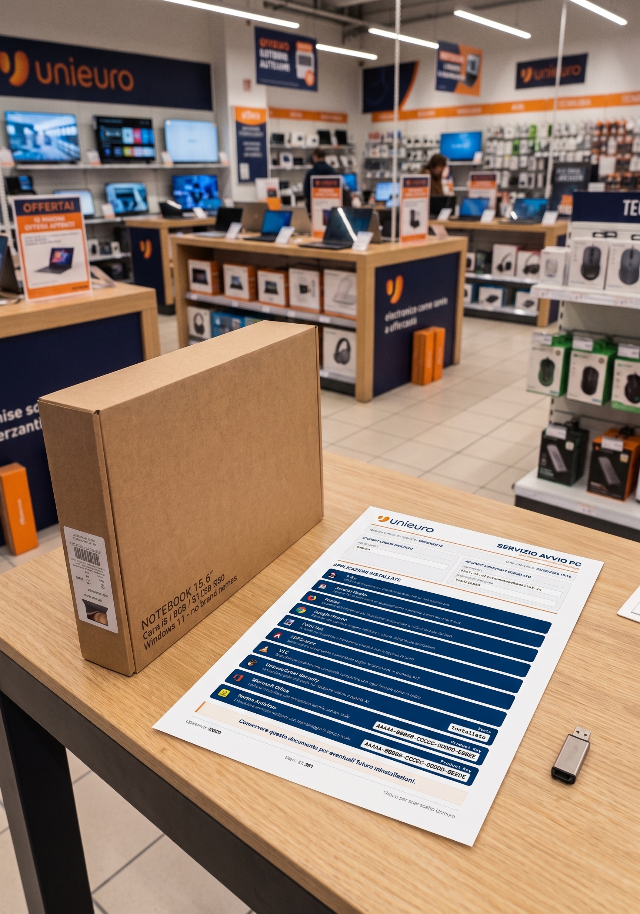

# **AvvioPC Pro: la nuova era del deployment**

**AvvioPC Pro** rappresenta l'evoluzione definitiva del primordiale *AvvioPC*, nato originariamente come un semplice script batch DOS per semplificare le configurazioni iniziali di computer in ambito retail. L'idea era quella di superare le limitazioni di pacchetti commerciali come Ninite o Chocolately, prima fra tutte la caratteristica di richiedere lunghi download per l'installazione degli applicativi.

Ma la semplicità del primo *AvvioPC*, pensato per una manutenzione direttamente in produzione tramite un banale editor di testo, è stata anche il suo più grande limite: l'avvento di sempre nuovi software da installare, l'assenza di funzioni di upgrade o di reportistica e la necessità di eseguire comunque in modo manuale molti passaggi (OOBE, antivirus, Office), operazione che non tutti i commessi sono preparati a fare, ne hanno sancito anche i limiti.

Per questo motivo nasce l'ecosistema **AvvioPC Pro**, un installer definitivo e professionale, strutturato su tre moduli perfettamente integrati.

L'adozione di questa suite trasforma radicalmente l'operatività del punto vendita: l'automazione spinta azzera i tempi morti e i colli di bottiglia tecnici, garantendo un incremento immediato della produttività. Questo si traduce in una drastica riduzione dei costi occulti di configurazione e in un servizio al cliente impeccabile, elevando gli standard qualitativi e l'efficienza dell'intera azienda.

| Modulo operativo | Piattaforma target | Obiettivo strategico e funzioni  chiave |
| :--- | :--- | :--- |
| **1. Web App Front-End** | Smartphone / Mobile Browser | Barcode scanner S/N, OCR Product Key, Generazione MSA & PIN client-side |
| **2. USB Zero-Touch** | Notebook / PC in Lavorazione | Bypass OOBE, provisioning offline, installazione silent app & AV, auto-update Cloudflare |
| **3. Demone di Stampa** | PC di Rete / Banco Servizi | Ricezione job da server, generazione automatica e stampa del report di consegna professionale |

## **1. Il centro di controllo: eeb app di front-end**

Il fulcro operativo dell'interazione con il commesso è un'applicazione web PWA installabile su qualsiasi smartphone (Android o iOS), concepita per essere utilizzata in mobilità e in presenza del cliente prima del passaggio in cassa.

* **Acquisizione dati avanzata:** E' stato implementato un lettore barcode tramite fotocamera per associare istantaneamente il serial number (S/N) del PC. Sono altresì presenti moduli OCR per acquisire i product key delle licenze ed iniettarli in modalità totalmente *unattended* durante il provisioning.
* **Gestione zccount Microsoft (MSA):** E' presente un algoritmo di generazione automatizzata delle credenziali per i nuovi account MSA. L'operatività in presenza del cliente si rivela strategica e indispensabile per ricevere e confermare in tempo reale il PIN di verifica inviato da Microsoft sullo smartphone dell'utente.

## **2. L'Esecutore Silente: chiavetta USB zero-touch**

Il vero motore dell'automazione sul campo è la chiavetta USB di servizio. Il supporto si genera e si aggiorna tramite un web Installer dedicato, quest'ultimo scaricabile ed installabile su un qualsiasi PC connesso ad Internet, ad esempio un notebook in esposizione.

* **Configurazione automatica zero-touch:** È sufficiente collegare l'alimentazione al computer da configurare, inserire la chiavetta USB e accendere la macchina per saltare a piè pari tutte le innumerevoli schermate OOBE di Microsoft Windows 11.
* **Provisioning offline integrato:** Il sistema esegue la disinstallazione pulita degli antivirus dimostrativi e procede all'installazione *unattended* della suite di applicazioni predefinite. Inietta l'account Microsoft precedentemente creato, gestisce l'attivazione di Microsoft Office, e configura l'antivirus commerciale selezionato (Unieuro Everyday Digital, Norton 360 o McAfee), forzando all'occorrenza gli aggiornamenti via Windows Update.
* **Sincronizzazione via cloud autoaggiornante:** Al termine delle lavorazioni, il software verifica la presenza di nuove release del pacchetto sui server Cloudflare R2 e scarica autonomamente gli aggiornamenti (questa funzionalità prevede un bypass rapido in caso di consegne urgenti).

[ INSERIRE IMMAGINE NOTIFICHE WPF QUI ]

* **Diagnostica e telemetria visiva:** Una finestra di console monitora l'avanzamento registrando ogni evento in appositi file di log. Eventuali interruzioni o anomalie vengono prontamente segnalate tramite maxi-banner visivi ad alto contrasto, leggibili anche a grande distanza nell'area di lavoro.

## **3. La prova tangibile: il demone di Stampa**

A chiudere l'architettura della suite interviene un'utility residente e auto aggiornante installabile su un qualsiasi computer connesso alla rete locale del negozio.

* **Flusso di Lavoro asincrono:** Il demone lavora in background e in modo del tutto silente, rimanendo in ascolto delle chiamate provenienti dalla Web App.
* **Generazione automatica:** Non appena i dati di configurazione vengono inviati al server centralizzato, il demone elabora le informazioni e manda automaticamente in stampa un report sintetico, elegante e professionale.
* **Trasparenza verso il cliente:** Tale report è concepito per essere consegnata al cliente al momento del ritiro, fornendo una prova tangibile, chiara e trasparente di tutte le attività tecniche svolte sul suo computer.

---

> **▲ Note di sviluppo & filosofia progettuale:**
> Questo software è stato scritto dall'autore a titolo completamente gratuito e senza fini di lucro. Limitazioni nell'installazione di software commerciale derivano dall'impossibilità di acquistare a proprie spese licenze di test, costringendo a verifiche direttamente in produzioen. Per quanto possibile si è comunque cercato di realizzare un prodotto di livello professionale, robusto e dall'utilizzo intuitivo. Un prodotto nato e pensato direttamente sul campo... **da commesso, per i commessi**.
